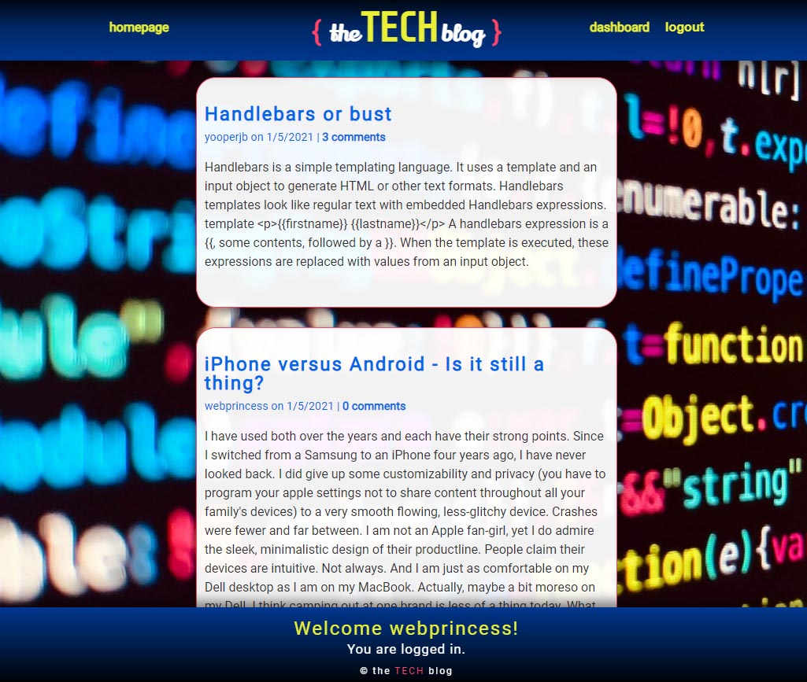

# The Tech Blog

## Table of Contents
  1. [Description](#description)
  2. [Built With](#built-with)
  3. [Website and Github](#website-and-github)
  4. [Tests](#tests)
  5. [Questions](#questions)
  
## Description
The Tech Blog is a CMS blog site for developers who write about Tech.  The homepage displays all the blog posts for the site. Users can sign-up, log in, create, edit and delete blog posts.  One can also post comments on other users' posts.  Each user has a personalized dashboard that displays their posts with a form to create new posts.  

This project follows the Model-View-Controller architectural paradigm. Bcrypt and Dotenv npm package installations secure passwords and the database.

## Built With
- Node.js
- JavaScript
- HTML
- Express-Handlebars
- Express
- Express-Session
- MySql2
- Sequelize
- CSS3
- BCrpyt
- Dotenv
   
## Website and Github

[Heroku Deployment](https://morning-inlet-04483.herokuapp.com/)

[Github Pages](https://github.com/webprinc3ss/e-commerce-back-end)
 
## Tests
Tests were run using Jest.  API endpoints were tested in Insomnia.

## Questions
Please feel free to contact me, webprinc3ss at Github: https://github.com/webprinc3ss 

or

djabranton@gmail.com. 
      